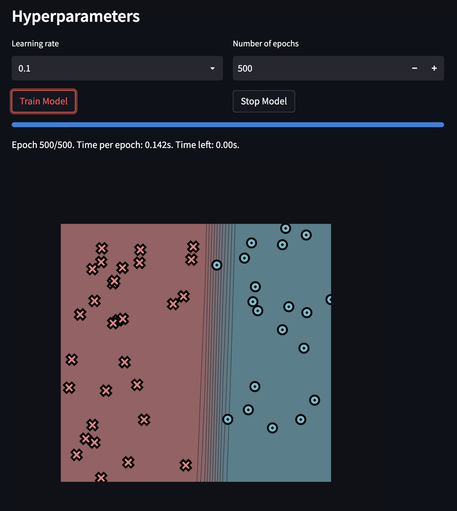
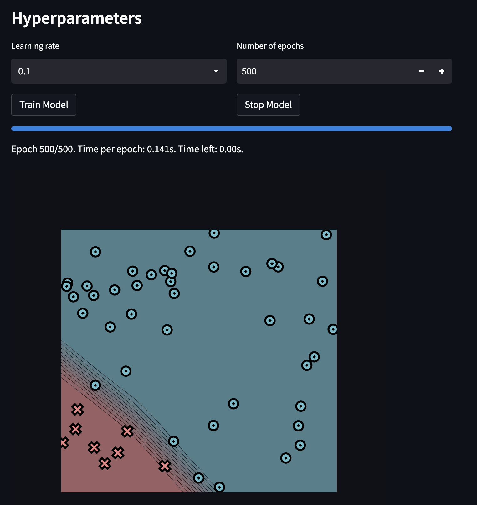
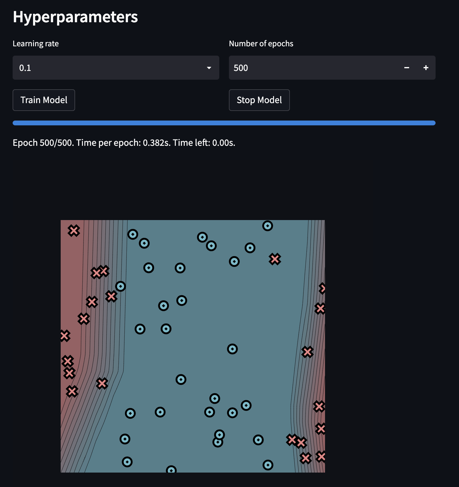
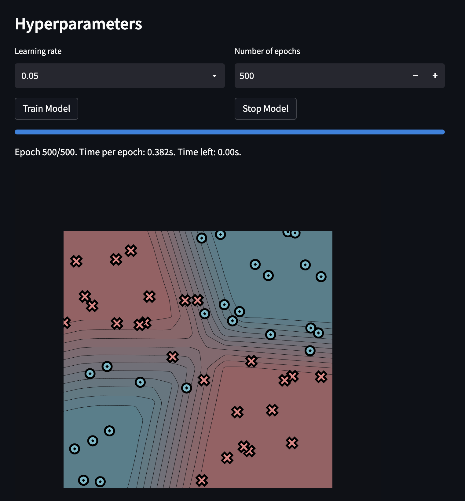

[](https://classroom.github.com/a/YFgwt0yY)
# MiniTorch Module 2


* Docs: https://minitorch.github.io/

* Overview: https://minitorch.github.io/module2/module2/

This assignment requires the following files from the previous assignments. You can get these by running

```bash
python sync_previous_module.py previous-module-dir current-module-dir
```

The files that will be synced are:

        minitorch/operators.py minitorch/module.py minitorch/autodiff.py minitorch/scalar.py minitorch/scalar_functions.py minitorch/module.py project/run_manual.py project/run_scalar.py project/datasets.py


## Module Task 2.5

### Simple
Time per epoch: 0.142s
Hyperparameters
- n: 50
- hidden layers: 5
- learning rate: 0.1
- epochs: 500



#### Logs
```
Epoch: 0/500, loss: 0, correct: 0
Epoch: 10/500, loss: 39.78340518439402, correct: 20
Epoch: 20/500, loss: 35.51610826447324, correct: 20
Epoch: 30/500, loss: 32.97124538659238, correct: 20
Epoch: 40/500, loss: 31.192389578389133, correct: 45
Epoch: 50/500, loss: 29.61755814399094, correct: 47
Epoch: 60/500, loss: 27.97937044886501, correct: 50
Epoch: 70/500, loss: 26.124460211314574, correct: 50
Epoch: 80/500, loss: 24.036184960397183, correct: 50
Epoch: 90/500, loss: 21.80342702155224, correct: 48
Epoch: 100/500, loss: 19.537667053704098, correct: 50
Epoch: 110/500, loss: 17.290741456712247, correct: 50
Epoch: 120/500, loss: 15.193117226196799, correct: 50
Epoch: 130/500, loss: 13.347196265230735, correct: 50
Epoch: 140/500, loss: 11.742679553637405, correct: 50
Epoch: 150/500, loss: 10.358785579461104, correct: 50
Epoch: 160/500, loss: 9.193882359731965, correct: 50
Epoch: 170/500, loss: 8.217367412630109, correct: 50
Epoch: 180/500, loss: 7.396375347523051, correct: 50
Epoch: 190/500, loss: 6.698589900681432, correct: 50
Epoch: 200/500, loss: 6.107990669053946, correct: 50
Epoch: 210/500, loss: 5.602731712867014, correct: 50
Epoch: 220/500, loss: 5.166522832579482, correct: 50
Epoch: 230/500, loss: 4.788983677997564, correct: 50
Epoch: 240/500, loss: 4.460005820042302, correct: 50
Epoch: 250/500, loss: 4.1723727159491695, correct: 50
Epoch: 260/500, loss: 3.9161190302689404, correct: 50
Epoch: 270/500, loss: 3.6922566842351903, correct: 50
Epoch: 280/500, loss: 3.4921579715063658, correct: 50
Epoch: 290/500, loss: 3.313763164476061, correct: 50
Epoch: 300/500, loss: 3.1527269405575407, correct: 50
Epoch: 310/500, loss: 3.0064789355567485, correct: 50
Epoch: 320/500, loss: 2.8734232856343147, correct: 50
Epoch: 330/500, loss: 2.7514046105000167, correct: 50
Epoch: 340/500, loss: 2.6390804742865037, correct: 50
Epoch: 350/500, loss: 2.5353507432319984, correct: 50
Epoch: 360/500, loss: 2.4393193924220222, correct: 50
Epoch: 370/500, loss: 2.350923099866986, correct: 50
Epoch: 380/500, loss: 2.268576769380497, correct: 50
Epoch: 390/500, loss: 2.1916557947718567, correct: 50
Epoch: 400/500, loss: 2.119635978830632, correct: 50
Epoch: 410/500, loss: 2.051823200483071, correct: 50
Epoch: 420/500, loss: 1.9880228252321062, correct: 50
Epoch: 430/500, loss: 1.9280027686537473, correct: 50
Epoch: 440/500, loss: 1.8722942411626609, correct: 50
Epoch: 450/500, loss: 1.819630794600848, correct: 50
Epoch: 460/500, loss: 1.769751480952408, correct: 50
Epoch: 470/500, loss: 1.722438521887534, correct: 50
Epoch: 480/500, loss: 1.6774971208940235, correct: 50
Epoch: 490/500, loss: 1.6347767083159328, correct: 50
Epoch: 500/500, loss: 1.5941725473808033, correct: 50
```

### Diag
Time per epoch: 0.142s

Hyperparameters
- n: 50
- hidden layers: 5
- learning rate: 0.1
- epochs: 500



#### Logs
```
Epoch: 0/500, loss: 0, correct: 0
Epoch: 10/500, loss: 21.211684958956006, correct: 42
Epoch: 20/500, loss: 16.59953598019219, correct: 42
Epoch: 30/500, loss: 14.995837122168206, correct: 42
Epoch: 40/500, loss: 13.786033496835422, correct: 42
Epoch: 50/500, loss: 12.678922676397105, correct: 42
Epoch: 60/500, loss: 11.794959230195174, correct: 42
Epoch: 70/500, loss: 10.99946798286297, correct: 43
Epoch: 80/500, loss: 10.277672024806021, correct: 45
Epoch: 90/500, loss: 9.625303343811145, correct: 45
Epoch: 100/500, loss: 9.020123431332298, correct: 47
Epoch: 110/500, loss: 8.46612522500741, correct: 47
Epoch: 120/500, loss: 7.96142433516241, correct: 47
Epoch: 130/500, loss: 7.507432002580178, correct: 47
Epoch: 140/500, loss: 7.092302147834388, correct: 48
Epoch: 150/500, loss: 6.712707381624494, correct: 49
Epoch: 160/500, loss: 6.365502632269697, correct: 49
Epoch: 170/500, loss: 6.047799132314691, correct: 49
Epoch: 180/500, loss: 5.76009374459203, correct: 50
Epoch: 190/500, loss: 5.4960761697781235, correct: 50
Epoch: 200/500, loss: 5.252857839768183, correct: 50
Epoch: 210/500, loss: 5.029075304084371, correct: 50
Epoch: 220/500, loss: 4.823696127606666, correct: 50
Epoch: 230/500, loss: 4.633761057287855, correct: 50
Epoch: 240/500, loss: 4.457866110195979, correct: 50
Epoch: 250/500, loss: 4.294527677454414, correct: 50
Epoch: 260/500, loss: 4.143044751896869, correct: 50
Epoch: 270/500, loss: 4.001872181513608, correct: 50
Epoch: 280/500, loss: 3.8700867832096923, correct: 50
Epoch: 290/500, loss: 3.747824337831139, correct: 50
Epoch: 300/500, loss: 3.634549770303902, correct: 50
Epoch: 310/500, loss: 3.528662978309346, correct: 50
Epoch: 320/500, loss: 3.4303444588729897, correct: 50
Epoch: 330/500, loss: 3.337524281427601, correct: 50
Epoch: 340/500, loss: 3.2507163452094923, correct: 50
Epoch: 350/500, loss: 3.169450260956548, correct: 50
Epoch: 360/500, loss: 3.0932093856623935, correct: 50
Epoch: 370/500, loss: 3.020589576786081, correct: 50
Epoch: 380/500, loss: 2.952188331017433, correct: 50
Epoch: 390/500, loss: 2.887634148636051, correct: 50
Epoch: 400/500, loss: 2.8266906086707704, correct: 50
Epoch: 410/500, loss: 2.7689715732937765, correct: 50
Epoch: 420/500, loss: 2.7135649271832905, correct: 50
Epoch: 430/500, loss: 2.660881469084603, correct: 50
Epoch: 440/500, loss: 2.6107279575770614, correct: 50
Epoch: 450/500, loss: 2.5631687564556724, correct: 50
Epoch: 460/500, loss: 2.5178143948962464, correct: 50
Epoch: 470/500, loss: 2.474166680530597, correct: 50
Epoch: 480/500, loss: 2.4326885832861933, correct: 50
Epoch: 490/500, loss: 2.3924657301535204, correct: 50
Epoch: 500/500, loss: 2.353845332364493, correct: 50
```

### Split
Time per epoch: 0.382s

Hyperparameters
- n: 50
- hidden layers: 10
- learning rate: 0.1
- epochs: 500



#### Logs
```
Epoch: 0/500, loss: 0, correct: 0
Epoch: 10/500, loss: 33.689910631900744, correct: 29
Epoch: 20/500, loss: 33.36884908057608, correct: 33
Epoch: 30/500, loss: 33.160239738320406, correct: 33
Epoch: 40/500, loss: 32.91691806728629, correct: 33
Epoch: 50/500, loss: 32.64508381987364, correct: 34
Epoch: 60/500, loss: 32.387508109636805, correct: 34
Epoch: 70/500, loss: 32.14104640772561, correct: 34
Epoch: 80/500, loss: 31.761600162301622, correct: 34
Epoch: 90/500, loss: 31.463086779067343, correct: 34
Epoch: 100/500, loss: 31.161793352652133, correct: 34
Epoch: 110/500, loss: 30.83194154526269, correct: 34
Epoch: 120/500, loss: 30.47213880505162, correct: 34
Epoch: 130/500, loss: 30.085094562884866, correct: 35
Epoch: 140/500, loss: 29.662676804179814, correct: 35
Epoch: 150/500, loss: 29.20243557996901, correct: 36
Epoch: 160/500, loss: 28.703554880183432, correct: 37
Epoch: 170/500, loss: 28.168902697884896, correct: 37
Epoch: 180/500, loss: 27.592190089896036, correct: 38
Epoch: 190/500, loss: 26.971473514680394, correct: 38
Epoch: 200/500, loss: 26.307895928289188, correct: 38
Epoch: 210/500, loss: 25.61380788581931, correct: 39
Epoch: 220/500, loss: 24.898810827368894, correct: 39
Epoch: 230/500, loss: 24.14981453110733, correct: 39
Epoch: 240/500, loss: 23.368503558854748, correct: 41
Epoch: 250/500, loss: 22.558605076175436, correct: 44
Epoch: 260/500, loss: 21.726860290995553, correct: 45
Epoch: 270/500, loss: 20.87910090768424, correct: 46
Epoch: 280/500, loss: 20.02021242156207, correct: 46
Epoch: 290/500, loss: 19.16206596291754, correct: 46
Epoch: 300/500, loss: 18.31445816639709, correct: 48
Epoch: 310/500, loss: 17.499282165241237, correct: 48
Epoch: 320/500, loss: 16.902137963620703, correct: 45
Epoch: 330/500, loss: 18.32574665320059, correct: 44
Epoch: 340/500, loss: 20.99587060605958, correct: 40
Epoch: 350/500, loss: 17.38535748804047, correct: 44
Epoch: 360/500, loss: 15.274384582795516, correct: 47
Epoch: 370/500, loss: 14.569005090840761, correct: 47
Epoch: 380/500, loss: 14.49002860355966, correct: 45
Epoch: 390/500, loss: 15.102539191986791, correct: 44
Epoch: 400/500, loss: 15.115943806363626, correct: 44
Epoch: 410/500, loss: 13.165286110764985, correct: 45
Epoch: 420/500, loss: 11.781332702901352, correct: 46
Epoch: 430/500, loss: 11.408537682406596, correct: 46
Epoch: 440/500, loss: 12.388985256523469, correct: 45
Epoch: 450/500, loss: 13.922390501682347, correct: 44
Epoch: 460/500, loss: 10.768992313841244, correct: 46
Epoch: 470/500, loss: 9.118605804647997, correct: 49
Epoch: 480/500, loss: 8.677097295604181, correct: 49
Epoch: 490/500, loss: 8.747150458913984, correct: 48
Epoch: 500/500, loss: 10.561303347491961, correct: 46
```
### XOR
Time per epoch: 0.382s

Hyperparameters
- n: 50
- hidden layers: 10
- learning rate: 0.05
- epochs: 500



#### Logs
```
Epoch: 0/500, loss: 0, correct: 0
Epoch: 10/500, loss: 32.079142450953725, correct: 35
Epoch: 20/500, loss: 31.620856051096634, correct: 35
Epoch: 30/500, loss: 31.25878039307904, correct: 35
Epoch: 40/500, loss: 30.89899046842458, correct: 36
Epoch: 50/500, loss: 30.55636444247768, correct: 36
Epoch: 60/500, loss: 30.21928289211857, correct: 36
Epoch: 70/500, loss: 29.88710909847457, correct: 36
Epoch: 80/500, loss: 29.552987839901732, correct: 36
Epoch: 90/500, loss: 29.208569679415195, correct: 37
Epoch: 100/500, loss: 28.85608730655068, correct: 37
Epoch: 110/500, loss: 28.505829714317294, correct: 37
Epoch: 120/500, loss: 28.150045372835173, correct: 37
Epoch: 130/500, loss: 27.797036266918006, correct: 38
Epoch: 140/500, loss: 27.441422057580436, correct: 38
Epoch: 150/500, loss: 27.09010416552848, correct: 38
Epoch: 160/500, loss: 26.729452209599383, correct: 38
Epoch: 170/500, loss: 26.368386586378293, correct: 38
Epoch: 180/500, loss: 26.01253605732581, correct: 38
Epoch: 190/500, loss: 25.652523407231644, correct: 39
Epoch: 200/500, loss: 25.284590408229374, correct: 39
Epoch: 210/500, loss: 24.910647571839075, correct: 39
Epoch: 220/500, loss: 24.53683567500982, correct: 40
Epoch: 230/500, loss: 24.15089619287465, correct: 40
Epoch: 240/500, loss: 23.74016280571512, correct: 42
Epoch: 250/500, loss: 23.324368468375372, correct: 43
Epoch: 260/500, loss: 22.840498727788546, correct: 44
Epoch: 270/500, loss: 22.255369683376983, correct: 44
Epoch: 280/500, loss: 21.641808264140955, correct: 44
Epoch: 290/500, loss: 21.08129316455717, correct: 44
Epoch: 300/500, loss: 20.576881496836364, correct: 44
Epoch: 310/500, loss: 20.086175738605906, correct: 44
Epoch: 320/500, loss: 19.606985636071876, correct: 44
Epoch: 330/500, loss: 19.138839295862624, correct: 44
Epoch: 340/500, loss: 18.686514121750044, correct: 44
Epoch: 350/500, loss: 18.240761738061696, correct: 44
Epoch: 360/500, loss: 17.801485222549783, correct: 44
Epoch: 370/500, loss: 17.369553583128823, correct: 44
Epoch: 380/500, loss: 16.944197660923248, correct: 44
Epoch: 390/500, loss: 16.52961527179688, correct: 45
Epoch: 400/500, loss: 16.126017130381154, correct: 45
Epoch: 410/500, loss: 15.733806380616011, correct: 45
Epoch: 420/500, loss: 15.352901867850019, correct: 45
Epoch: 430/500, loss: 14.98857327372399, correct: 45
Epoch: 440/500, loss: 14.637759790270703, correct: 46
Epoch: 450/500, loss: 14.297187738106174, correct: 46
Epoch: 460/500, loss: 13.96666332593578, correct: 46
Epoch: 470/500, loss: 13.647264456583844, correct: 47
Epoch: 480/500, loss: 13.333197442043149, correct: 47
Epoch: 490/500, loss: 13.037342667573595, correct: 47
Epoch: 500/500, loss: 12.752947886209936, correct: 47
```